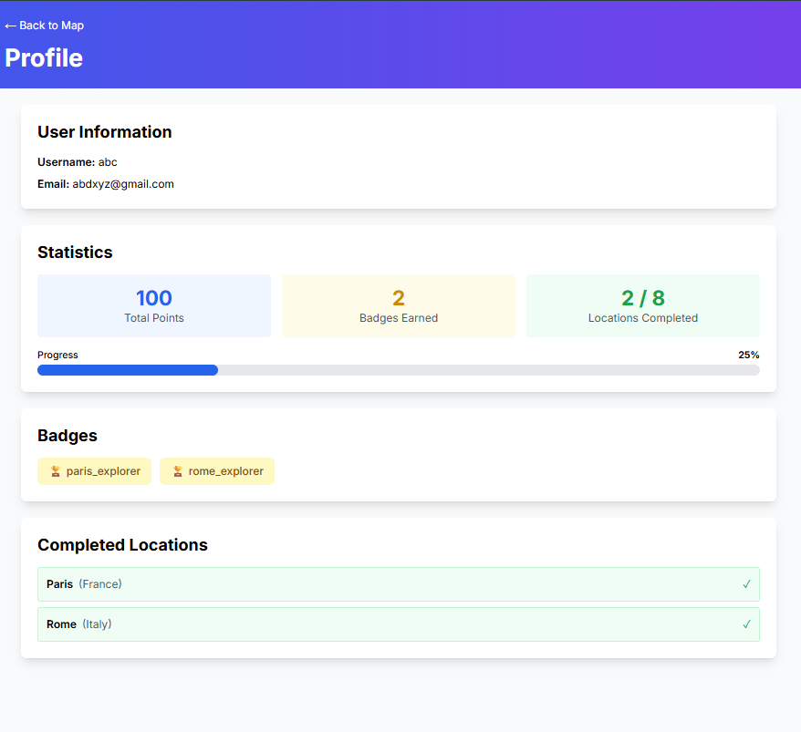

# Treasure Hunt Map

A real-world treasure hunt game where users explore an interactive map, solve challenges, and collect points and badges. Built with Next.js, Express, MongoDB, and Leaflet.js.





## Features

- **Interactive World Map** - Explore cities and locations on a real-world map
- **Challenge System** - Solve quizzes, riddles, and logic puzzles
- **Progress Tracking** - Earn points and badges as you complete challenges
- **Leaderboard** - Compete with other players globally
- **User Profiles** - Track your progress and achievements
- **Authentication** - Secure user accounts with JWT
- **Modern UI** - Clean, responsive design with Tailwind CSS

## Tech Stack

### Frontend
- Next.js 14 (React)
- TypeScript
- Tailwind CSS
- Leaflet.js (Interactive Maps)
- Axios (API Client)

### Backend
- Node.js + Express
- MongoDB + Mongoose
- JWT Authentication
- bcryptjs (Password Hashing)

## Getting Started

### Prerequisites
- Node.js 18+ installed
- MongoDB installed and running (or MongoDB Atlas connection string)

### Installation

1. **Install all dependencies:**
   ```bash
   npm run install:all
   ```

2. **Set up environment variables:**

   Create `backend/.env` file:
   ```env
   PORT=5000
   MONGODB_URI=mongodb://localhost:27017/treasure-hunt
   JWT_SECRET=your-super-secret-jwt-key-change-this-in-production
   ```

   Create `frontend/.env.local` file:
   ```env
   NEXT_PUBLIC_API_URL=http://localhost:5000/api
   ```

3. **Start the development servers:**
   ```bash
   npm run dev
   ```

   This will start:
   - Frontend on `http://localhost:3000`
   - Backend on `http://localhost:5000`

### Database Setup

The application will automatically create the database schema on first run. To seed initial data, you can use the admin panel (requires admin account) or manually insert data into MongoDB.

## Project Structure

```
treasure-hunt-map/
├── frontend/           # Next.js frontend application
│   ├── app/           # Next.js app directory
│   ├── components/    # React components
│   ├── contexts/      # React contexts (Auth)
│   └── lib/           # Utilities and API client
├── backend/           # Express backend API
│   ├── models/        # MongoDB models
│   ├── routes/        # API routes
│   ├── middleware/    # Auth middleware
│   └── server.js      # Express server
└── package.json       # Root package.json
```

## API Endpoints

### Authentication
- `POST /api/auth/register` - Register new user
- `POST /api/auth/login` - Login user
- `GET /api/auth/me` - Get current user

### Locations
- `GET /api/locations` - Get all locations
- `GET /api/locations/:locationId` - Get single location

### Challenges
- `GET /api/challenges/location/:locationId` - Get challenge for location
- `POST /api/challenges/submit` - Submit answer

### Progress
- `GET /api/progress` - Get user progress

### Leaderboard
- `GET /api/leaderboard/global` - Get global leaderboard
- `GET /api/leaderboard/my-rank` - Get user's rank

### Admin (requires admin auth)
- `POST /api/admin/locations` - Create location
- `POST /api/admin/challenges` - Create challenge
- `PUT /api/admin/locations/:locationId` - Update location
- `DELETE /api/admin/locations/:locationId` - Delete location

## Admin Access

To access admin features, create a user with username "admin". Admin routes require authentication and admin username.

## Features in Detail

### Map Exploration
- Click on city markers to view challenges
- Green markers = Completed
- Blue markers = Available
- Red markers = Locked

### Challenge Types
- **Quiz**: Multiple choice questions
- **Riddle**: Text-based riddles
- **Logic**: Logic puzzles
- **Word**: Word challenges
- **Number**: Number puzzles

### User Progression
- Earn points for completing challenges
- Collect badges for each location
- Track completion percentage
- View completed locations

## Future Enhancements

- Daily treasure challenges
- Hint system (spend points for hints)
- Multi-player real-time competition
- Regional leaderboards
- Achievement system
- Social features


